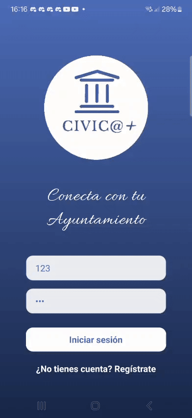
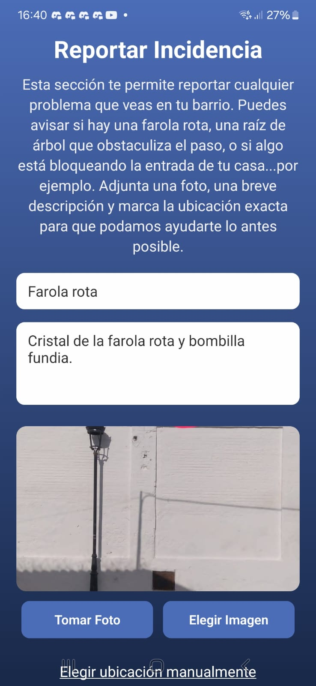
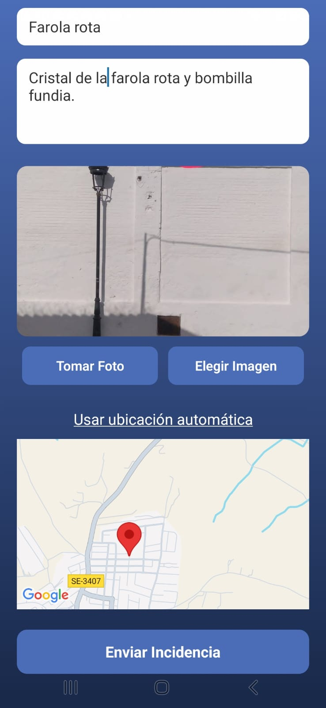
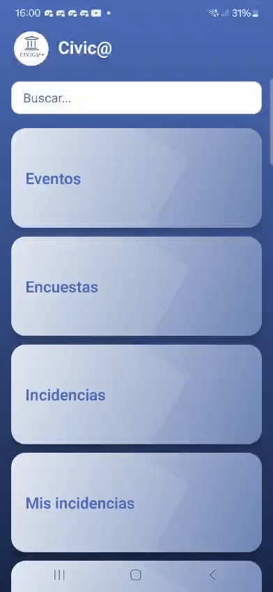
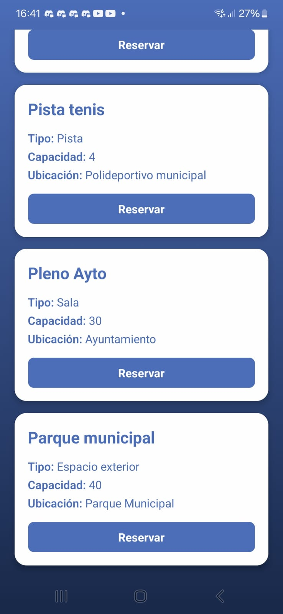
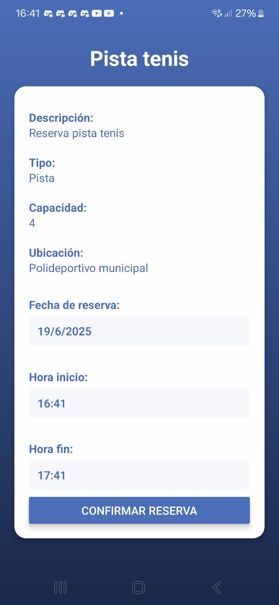
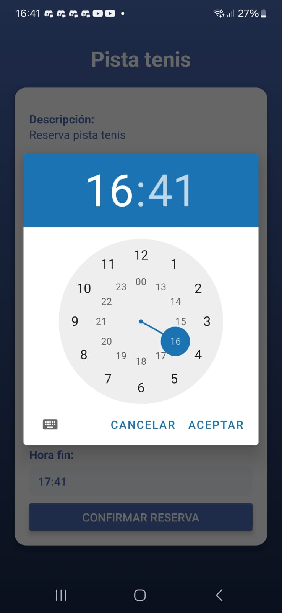

# Cívica+

📘 Available in: [Spanish](README.md) | [English](README.en.md)

Mobile Platform for Citizen Communication and Municipal Management

## Source Code

The complete source code is available in this repository: https://github.com/itoito0350/civic

---

## 🧠 Overview

**Cívica+** is a mobile app that improves communication between citizens and their local government. It allows users to:

- Report urban issues
- Participate in surveys
- Check events and news
- Book municipal spaces (sports, institutional)
- Use a simplified mode for users over 70 years old

---

## 🎯 Objectives

- Facilitate direct communication between citizens and the municipality
- Promote active citizen participation
- Optimize booking of public spaces
- Include an accessible mode for elderly users
- Ensure an accessible, cross-platform, and scalable design

---

## 🔐 Authentication and Security

- JWT-based login
- Role management and age validation

---

## 🔧 Main Modules

### 📸 Urban Issue Reporting
- Submit photos, descriptions, and location
- Track status updates

|  |  |
|-------------------------------------|-------------------------------------|

### 🗳️ Surveys and Citizen Participation
- Accessible surveys and voting
- Transparent results

### 🗓️ Events and Cultural Agenda
- Browse cultural, social, and sports activities

### 🏟️ Municipal Space Booking
- Online booking for sports courts or institutional rooms
- Availability control

|  |  |
|------------------------------------|------------------------------------|
|  |  |

### 👴 Simplified Mode for Elderly Users
- Large text, simplified navigation, big buttons
- Automatically activated by age

## 🧱 Technologies Used

| Component        | Technology          |
|------------------|---------------------|
| Mobile frontend  | React Native        |
| Backend          | Django REST Framework|
| Database         | PostgreSQL          |
| Maps             | Leaflet.js or Mapbox|
| Login            | JWT                 |

---

## 🗃️ Data Model (summary)

Includes users, issues, events, surveys, bookings, and municipal spaces, with well-defined relationships for efficient maintenance.

---

