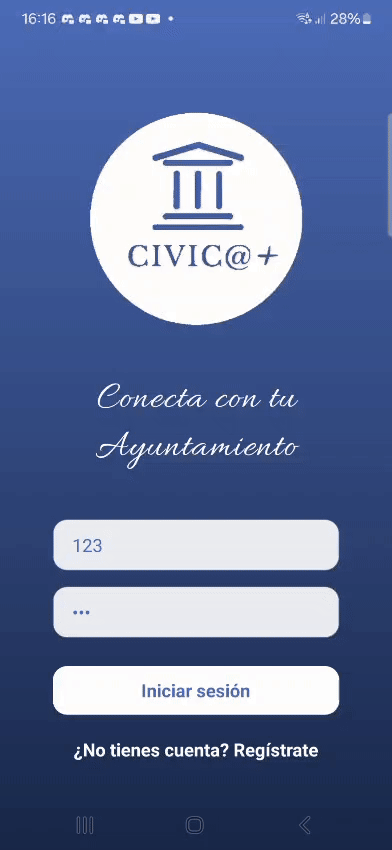
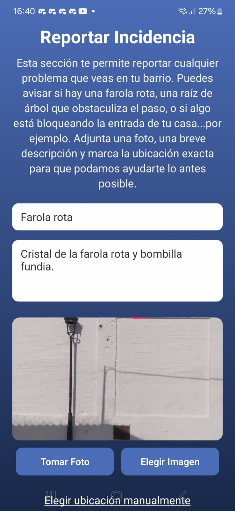
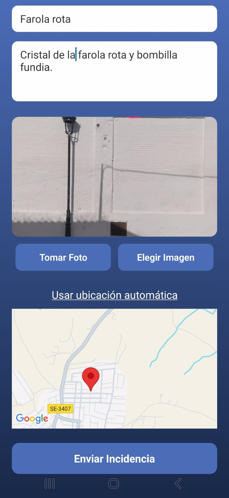
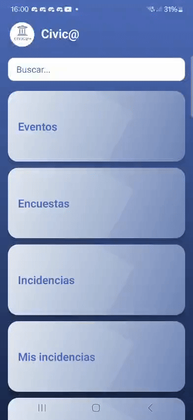
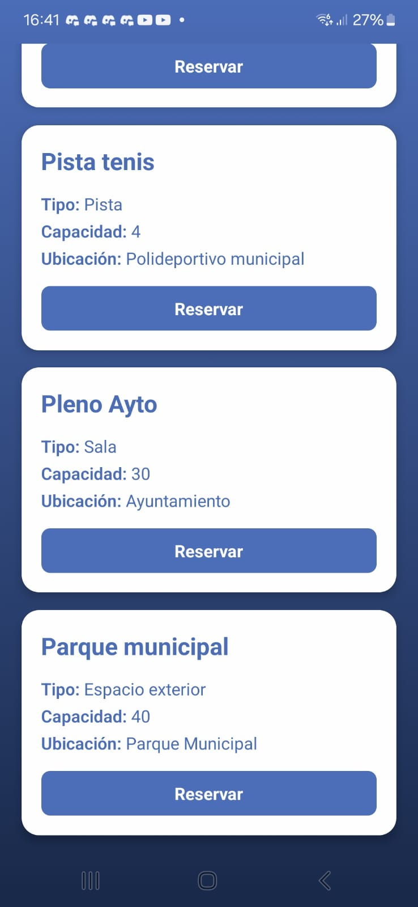
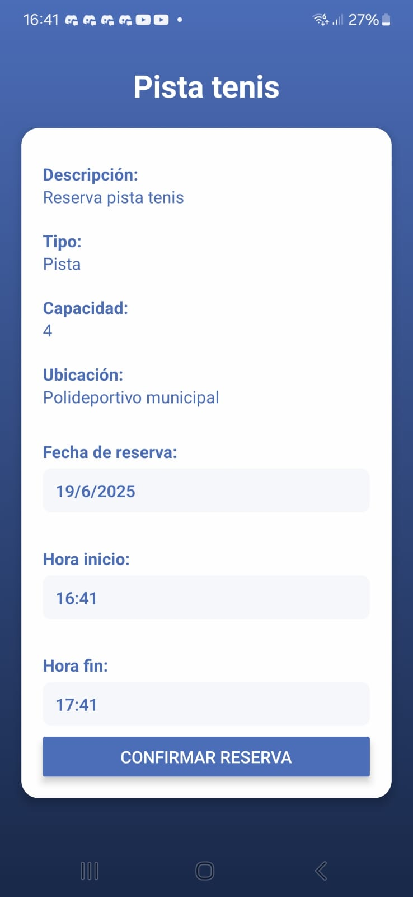
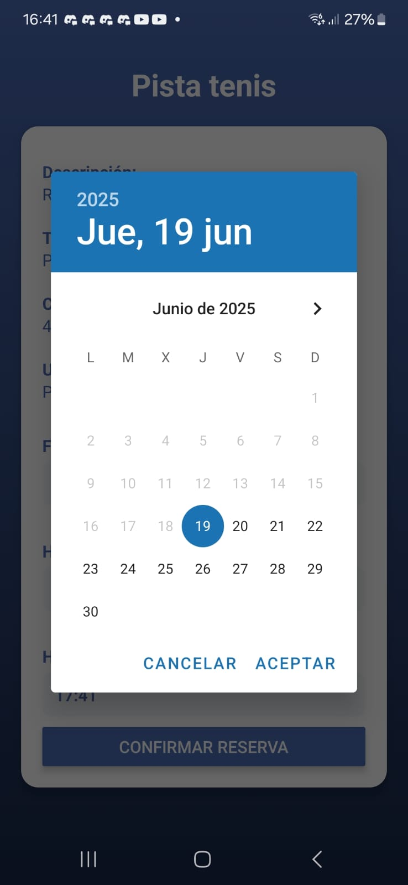
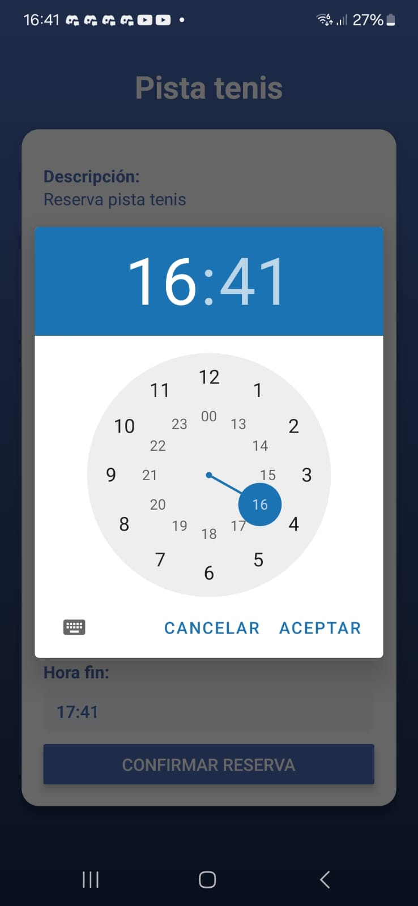

# Cívica+

📘 Disponible en: [Español](README.md) | [English](README.en.md)

Plataforma Móvil de Comunicación y Gestión Ciudadana para Ayuntamientos

## Código fuente

El código completo está disponible en este repositorio: 
https://github.com/itoito0350/civic

---

## 🧠 Descripción General

**Cívica+** es una app móvil que mejora la comunicación entre la ciudadanía y su ayuntamiento. Permite:

- Reportar incidencias urbanas
- Participar en encuestas
- Consultar eventos y noticias
- Reservar espacios municipales (deportivos, institucionales)
- Usar un modo simplificado para mayores de 70 años

---

## 🎯 Objetivos

- Facilitar la comunicación directa entre el ciudadano y el ayuntamiento
- Promover la participación ciudadana activa
- Optimizar reservas de espacios públicos
- Incluir un modo accesible para personas mayores
- Garantizar un diseño accesible, multiplataforma y escalable

---

## 🔐 Autenticación y Seguridad

- Inicio de sesión con JWT
- Roles y validación por edad

---

## 🔧 Módulos Principales

### 📸 Reporte de Incidencias Urbanas
- Envío de foto, descripción y ubicación
- Seguimiento del estado

|  |  |
|-------------------------------------------|--------------------------------------------|

### 🗳️ Encuestas y Participación Ciudadana
- Encuestas y votaciones accesibles
- Resultados transparentes

### 🗓️ Eventos y Agenda Cultural
- Consulta de actividades culturales, sociales y deportivas

### 🏟️ Reservas de Espacios Municipales
- Reservas online de pistas deportivas o salas institucionales
- Control de disponibilidad

|  |  |
|-------------------------------------|-------------------------------------|
|  |  |

### 👴 Modo Simplificado para Personas Mayores
- Texto grande, navegación reducida y botones grandes
- Activado automáticamente por edad

## 🧱 Tecnologías Utilizadas

| Componente        | Tecnología         |
|-------------------|--------------------|
| Frontend móvil    | React Native       |
| Backend           | Django REST Framework |
| Base de datos     | PostgreSQL         |
| Mapas             | Leaflet.js o Mapbox |
| Login             | JWT                |

---

## 🗃️ Modelo de Datos (resumen)

Incluye usuarios, incidencias, eventos, encuestas, reservas y espacios municipales, con relaciones bien definidas para un mantenimiento eficiente.

---

